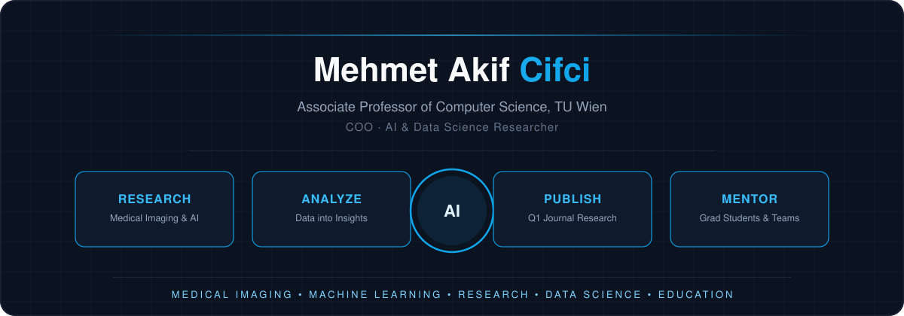

  

 

## About Me

I am an Associate Professor of Computer Science (TU Wien) and COO, working on AI systems for **medical imaging** and **intelligent automation**. My research spans machine learning, computer vision, and data science, with a focus on building transparent, scalable, and ethically aligned systems.

Current interests:
- Medical image classification, segmentation, and tumor detection
- Explainable AI, uncertainty quantification, and privacy-preserving / federated learning
- Vision transformers and CNN-based computer vision
- Applied data science and cloud-deployed ML systems

---

## Technology

  

  Also using: Keras &middot; Pandas &middot; NumPy &middot; Plotly &middot; Jupyter &middot; Dash &middot; Streamlit

---

## Selected Projects

**TÜBİTAK 2553 Bilateral R&D Program** — Principal Investigator. Cross-border research program covering AI-assisted medical diagnostics, cross-platform ML infrastructure, and responsible/explainable AI frameworks.
`Python` `TensorFlow` `Explainable AI`

**ECOLoPES — H2020 FET OPEN Project** (Grant Agreement No. 964414) — Research partner on this European Union Horizon 2020 FET OPEN funded initiative.
`Research` `EU Horizon 2020`

> Pinned repositories on this profile show the code side of my work; this section covers the research programs that don't live in a single repo.

---

## Contact

  
  
  
  
  

